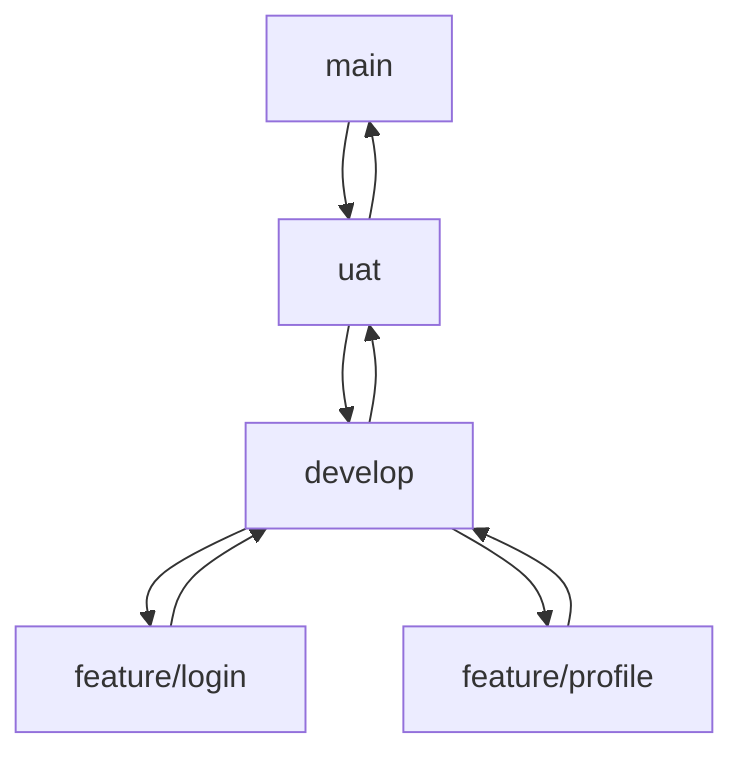

# 🧠 GitHub Workflow Guide (KEERATI Style) - Bilingual (EN/TH)

## 🚧 Branch Structure | โครงสร้าง Branch

- `main`: Production-ready code only | ใช้เฉพาะโค้ดที่พร้อมขึ้นระบบจริง
- `uat`: Pre-production testing (UAT) | ใช้ทดสอบกับผู้ใช้งานก่อนขึ้น production
- `develop`: Integration branch for all feature work | รวมฟีเจอร์ทั้งหมดก่อนส่งขึ้น UAT
- `feature/*`: Temporary branches for new feature or bugfix | แตก branch ย่อยเพื่อพัฒนาฟีเจอร์/แก้บั๊ก

---

## 🧭 Full Git Workflow

### ✅ Start a New Feature | เริ่มต้นพัฒนาฟีเจอร์ใหม่

```bash
git checkout develop
git pull origin develop
git checkout -b feature/awesome-login
```

---

### 🔁 Keep Your Feature Branch Updated | อัปเดต branch ให้ทัน develop

```bash
git fetch origin
git rebase origin/develop
```

หากเกิด conflict ให้แก้ไข แล้ว:

```bash
git add <conflicted-file>
git rebase --continue
```

ถ้ายกเลิกกลางทาง:

```bash
git rebase --abort
```

---

### ✅ Complete the Feature | เมื่องานเสร็จ

```bash
git fetch origin
git rebase origin/develop
git push origin feature/awesome-login
```

เปิด Pull Request: `feature/awesome-login` → `develop`

---

### 🚀 Promote to UAT | ส่งงานไปยัง UAT

```bash
git checkout uat
git pull origin uat
git merge develop --no-ff
git push origin uat
```

---

### 📦 Release to Production | ปล่อยขึ้นระบบจริง

```bash
git checkout main
git pull origin main
git merge uat --no-ff
git push origin main

# Optional tag:
git tag -a v1.0.0 -m "Release Login feature"
git push origin v1.0.0
```

---

## 📊 Git Visual Workflow | แผนภาพ Git Workflow



> ใช้ [Mermaid](https://mermaid.js.org) viewer หรือ GitHub ที่รองรับ Mermaid เพื่อดู diagram นี้

---

## 🔒 Branch Protection (แนะนำบน GitHub)

### `main` branch

- ✅ เปิดการรีวิว Pull Request ก่อน merge
- ✅ บังคับให้ผ่าน status check เช่น test/lint
- ✅ ปิดการใช้ merge commit (เพื่อให้ประวัติตรง)
- ✅ จำกัดคนที่ push ตรงได้

### `develop` branch

- ✅ เปิดการรีวิว PR ก่อน merge
- ✅ เปิดหรือปิด status check ตาม workflow
- ⛔ อนุญาต merge commit ได้ถ้าทีมต้องการเห็นรวมหลาย commit

### `uat` branch

- ✅ จำกัดเฉพาะ merge จาก `develop` เท่านั้น
- ✅ อาจกำหนดให้ต้อง tag release ทุกครั้ง
